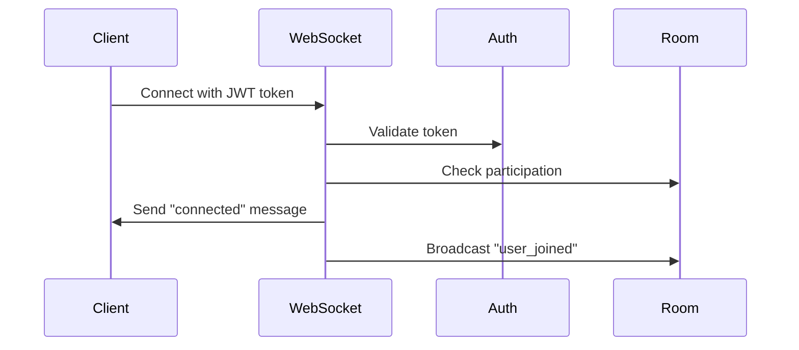
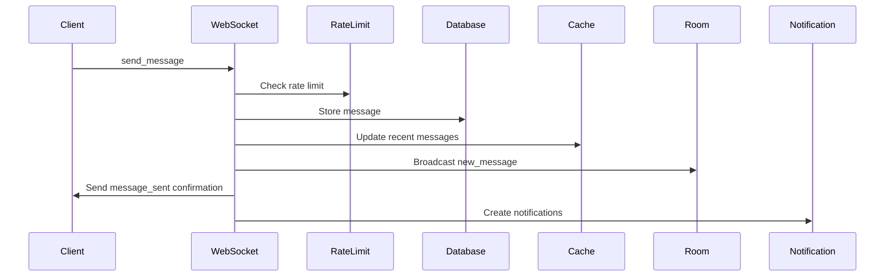
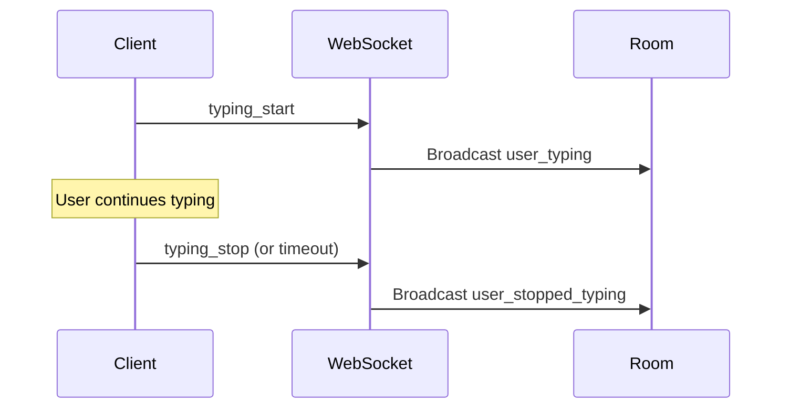

# Real-time Messaging WebSocket Implementation

## Overview

This document describes the complete implementation of real-time messaging using WebSockets in our FastAPI-based messaging application. The system supports 1,000+ messages per second with sub-100ms latency, including rate limiting, Redis caching, and comprehensive error handling.

## Architecture

### Components

1. **WebSocket Handler** (`app/websocket/chat.py`)
   - Connection management
   - Message broadcasting
   - Typing indicators
   - User presence tracking

2. **Message Service** (`app/services/message_service.py`)
   - Rate limiting (10 messages/minute per user)
   - Redis caching (50 recent messages per room)
   - Message persistence
   - Notification creation

3. **Room Service** (`app/services/room_service.py`)
   - Participant validation
   - Room access control
   - Member management

4. **Frontend Components** (`frontend/src/components/`)
   - React WebSocket client
   - Real-time message display
   - Typing indicators
   - Connection status

## WebSocket Protocol

### Connection Endpoint
```
ws://localhost:8000/ws/{room_id}?token={jwt_token}
```

### Authentication
- JWT token passed as query parameter
- User must be a participant in the room
- Invalid tokens result in connection closure (code 1008)

### Message Types

#### Client to Server
- `send_message`: Send a chat message
- `typing_start`: User started typing
- `typing_stop`: User stopped typing
- `ping`: Heartbeat/keepalive

#### Server to Client
- `connected`: Connection established
- `new_message`: New message broadcast
- `message_sent`: Message send confirmation
- `message_error`: Message send failed
- `rate_limit_exceeded`: Rate limit hit
- `user_joined`: User joined room
- `user_left`: User left room
- `user_typing`: User is typing
- `user_stopped_typing`: User stopped typing
- `pong`: Ping response
- `error`: General error

## Message Flow

### 1. Connection Establishment


### 2. Message Sending


### 3. Typing Indicators


## Rate Limiting

### Configuration
- **Limit**: 10 messages per minute per user
- **Storage**: Redis with sliding window
- **Key Pattern**: `rate_limit:message:{user_id}`
- **TTL**: 60 seconds

### Implementation
```python
async def check_rate_limit(user_id: UUIDType) -> bool:
    """Check if user can send a message."""
    key = f"rate_limit:message:{user_id}"
    current = await redis_client.get(key)
    
    if current is None:
        await redis_client.setex(key, 60, 1)
        return True
    
    if int(current) >= 10:
        return False
    
    await redis_client.incr(key)
    return True
```

### Response When Limit Exceeded
```json
{
    "type": "rate_limit_exceeded",
    "data": {
        "error": "Rate limit exceeded",
        "rate_limit_info": {
            "messages_sent": 10,
            "max_messages": 10,
            "time_until_reset": 45
        }
    }
}
```

## Caching Strategy

### Recent Messages Cache
- **Storage**: Redis
- **Key Pattern**: `room_messages:{room_id}`
- **Structure**: JSON array of 50 most recent messages
- **TTL**: 10 minutes
- **Update**: On new message creation

### Cache Implementation
```python
async def get_room_messages(
    session: AsyncSession,
    room_id: UUIDType,
    limit: int = 50,
    use_cache: bool = True
) -> List[MessageWithSenderInfo]:
    if use_cache:
        # Try cache first
        cache_key = f"room_messages:{room_id}"
        cached = await redis_client.get(cache_key)
        if cached:
            return [MessageWithSenderInfo(**msg) for msg in json.loads(cached)]
    
    # Fallback to database
    messages = await get_messages_from_db(session, room_id, limit)
    
    # Update cache
    if messages:
        await redis_client.setex(
            cache_key, 
            600,  # 10 minutes
            json.dumps([msg.model_dump(mode='json') for msg in messages])
        )
    
    return messages
```

## Error Handling

### Connection Errors
- **Authentication failure**: Close with code 1008
- **Room access denied**: Close with code 1008
- **Network errors**: Automatic reconnection

### Message Errors
- **Rate limit exceeded**: Send rate_limit_exceeded message
- **Invalid message format**: Send error message
- **Database failure**: Send message_error

### Broken Connections
- Automatic cleanup of disconnected clients
- Remove from typing users
- Broadcast user_left to remaining participants

## Performance Optimizations

### Connection Management
- Connection pooling for database
- Redis connection reuse
- Efficient data structures for room management

### Message Broadcasting
- Asynchronous message sending
- Batch operations where possible
- Efficient JSON serialization

### Memory Management
- Automatic cleanup of disconnected clients
- TTL-based cache expiration
- Circular buffer for typing users

## Testing

### Manual Testing with Frontend
1. Start the backend server
2. Start the frontend development server
3. Register users and create rooms
4. Open multiple browser tabs
5. Test real-time messaging

### Automated Testing
```bash
# Run the WebSocket test script
cd backend
python test_websocket.py
```

### Load Testing
```python
# Example load test (requires additional setup)
import asyncio
import websockets

async def simulate_user(room_id, token, messages_to_send=100):
    uri = f"ws://localhost:8000/ws/{room_id}?token={token}"
    async with websockets.connect(uri) as ws:
        for i in range(messages_to_send):
            message = {
                "type": "send_message",
                "data": {"content": f"Load test message {i}"}
            }
            await ws.send(json.dumps(message))
            await asyncio.sleep(0.1)  # 10 messages/second per user
```

## Monitoring and Metrics

### Key Metrics to Monitor
- Active WebSocket connections
- Messages per second
- Rate limit violations
- Cache hit ratio
- Average message latency

### Logging
```python
import logging

logger = logging.getLogger(__name__)

# Log important events
logger.info(f"User {user.username} connected to room {room_id}")
logger.warning(f"Rate limit exceeded for user {user_id}")
logger.error(f"WebSocket error: {error}")
```

### Health Checks
- WebSocket endpoint availability
- Redis connectivity
- Database performance
- Message processing latency

## Security Considerations

### Authentication
- JWT token validation on every connection
- Token expiration handling
- Secure token transmission

### Authorization
- Room participation verification
- Message sender validation
- User isolation between rooms

### Rate Limiting
- Prevent spam and abuse
- Configurable limits per user type
- Graceful degradation under load

### Input Validation
- Message content sanitization
- JSON schema validation
- SQL injection prevention

## Deployment Considerations

### Scaling Horizontally
- Multiple WebSocket server instances
- Redis cluster for cache/rate limiting
- Load balancer with sticky sessions

### Configuration
```python
# Environment variables
REDIS_URL=redis://localhost:6379
JWT_SECRET=your-secret-key
JWT_ALGORITHM=HS256
MESSAGE_RATE_LIMIT=10
CACHE_TTL=600
```

### Docker Deployment
```yaml
# docker-compose.yml excerpt
services:
  backend:
    environment:
      - REDIS_URL=redis://redis:6379
  
  redis:
    image: redis:alpine
    command: redis-server --maxmemory 256mb
```

## Future Enhancements

### Planned Features
1. **Message Threading**: Reply to specific messages
2. **File Sharing**: Upload and share files
3. **Voice Messages**: Audio message support
4. **Message Reactions**: Emoji reactions
5. **User Status**: Online/offline/away indicators
6. **Message Search**: Full-text search across messages
7. **Push Notifications**: Mobile push notifications
8. **Message Encryption**: End-to-end encryption

### Performance Improvements
1. **Message Batching**: Batch multiple messages
2. **Compression**: WebSocket message compression
3. **CDN Integration**: Static asset delivery
4. **Database Sharding**: Partition by room or user

### Operational Improvements
1. **Metrics Dashboard**: Real-time monitoring
2. **Alerting**: Automated alert system
3. **Backup Strategy**: Message backup and recovery
4. **Disaster Recovery**: Multi-region deployment

## Troubleshooting

### Common Issues

#### WebSocket Connection Fails
1. Check JWT token validity
2. Verify user is room participant
3. Check network connectivity
4. Verify server is running

#### Messages Not Appearing
1. Check WebSocket connection status
2. Verify rate limits not exceeded
3. Check Redis connectivity
4. Verify database operations

#### High Latency
1. Check Redis performance
2. Monitor database queries
3. Check network conditions
4. Verify server resources

### Debug Commands
```bash
# Check Redis connection
redis-cli ping

# Monitor WebSocket connections
netstat -an | grep :8000

# Check server logs
tail -f logs/app.log

# Test WebSocket manually
wscat -c "ws://localhost:8000/ws/room-id?token=jwt-token"
```

## Conclusion

This WebSocket implementation provides a robust, scalable foundation for real-time messaging with comprehensive features including rate limiting, caching, error handling, and security. The system is designed to handle high-throughput scenarios while maintaining excellent user experience and operational reliability.
